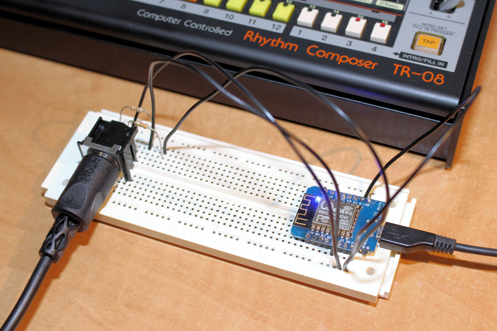
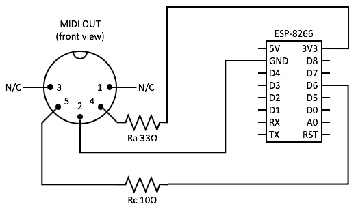

# ESP-8266 Send notes to a MIDI musical instruments

The **Musical Instrument Digital Interface (MIDI)** protocol allows communication between musical instruments and audio devices. The first MIDI synthesizer was the Roland Jupiter-6 and the first MIDI drum machine was the Roland TR-909. A single MIDI cable can carry information up to sixteen channels, or instruments. MIDI messages include musical notes, velocity, vibrato, panning, clock signal and system information. The serial trasmission rate for MIDI is always 31250 bits per second (bauds).

While the original MIDI protocol was designed for 5 V devices, the protocol was revised to include 3,3 V devices. This makes the ESP-8266 a perfect MIDI controller to send and receive MIDI information. This page explains the most basic circuit and program to send MIDI notes to any musical instruments, in this case the Roland TR-08. The program also uses the Software Serial library to send serial data on pin D6, instead of the default GPIO 1 (TX) pin.

## Material

No | Qty | Description | Manufacturer | P/N
---|-----|-----------|--------------|------------
1 | 1 | ESP-8266 microcontroller | WeMos | D1 Mini V2.3.0
2 | 1 | DIN 5-pin female connector | SWITCHCRAFT | 57PC5F
3 | 1 | Resistor 33Ω 1/4W 5% | Stackpole | CF14JT33R0
4 | 1 | Resistor 10Ω 1/4W 5% | Stackpole | CF14JT10R0

## Circuit

The following circuit diagram explains how create a MIDI OUT port on your ESP-8266.



## Code

```
/*
 * Copyright 2019 Richard Ng-Jobidon
 *
 * Licensed under the Apache License, Version 2.0 (the "License");
 * you may not use this file except in compliance with the License.
 * You may obtain a copy of the License at
 *
 *     http://www.apache.org/licenses/LICENSE-2.0
 *
 * Unless required by applicable law or agreed to in writing, software
 * distributed under the License is distributed on an "AS IS" BASIS,
 * WITHOUT WARRANTIES OR CONDITIONS OF ANY KIND, either express or implied.
 * See the License for the specific language governing permissions and
 * limitations under the License.
 */
 
// This program allows the ESP-8266 to send notes to a MIDI musical instrument

#include <SoftwareSerial.h>

// MIDI OUT serial port
SoftwareSerial MIDI_OUT_Serial(D5, D6); // RX, TX

// MIDI Message Types
const uint8_t NOTE_OFF = 0x80;
const uint8_t NOTE_ON = 0x90;
const uint8_t KEY_PRESSURE = 0xA0;
const uint8_t CC = 0xB0;
const uint8_t PROGRAM_CHANGE = 0xC0;
const uint8_t CHANNEL_PRESSURE = 0xD0;
const uint8_t PITCH_BEND = 0xE0;

// MIDI notes
const uint8_t note_A1 = 21;
const uint8_t note_C9 = 108;

// Roland TR-08 MIDI notes
const uint8_t note_BassDrum = 36;
const uint8_t note_RimShot = 37;
const uint8_t note_SnareDrum = 38;
const uint8_t note_HandClap = 39;
const uint8_t note_ClosedHiHat = 42;
const uint8_t note_LowTom = 43;
const uint8_t note_OpenHiHat = 46;
const uint8_t note_MidTom = 47;
const uint8_t note_Cymbal = 49;
const uint8_t note_HighTom = 50;
const uint8_t note_CowBell = 56;
const uint8_t note_HighConga = 62;
const uint8_t note_MidConga = 63;
const uint8_t note_LowConga = 64;
const uint8_t note_Maracas = 70;
const uint8_t note_Claves = 75;

// MIDI velocities
const uint8_t velocity_off = 0;
const uint8_t velocity_pianississimo = 16;
const uint8_t velocity_pianissimo = 32;
const uint8_t velocity_piupiano = 48;
const uint8_t velocity_mezzopiano = 64;
const uint8_t velocity_mezzoforte = 80;
const uint8_t velocity_forte = 96;
const uint8_t velocity_fortissimo = 112;
const uint8_t velocity_fortississimo = 127;

// MIDI channel
const uint8_t channel = 1;

// MIDI tempo
const uint8_t tempo = 110;            // Tempo in beats per minute
const int eight_note = 60000/tempo/2; // 8th note duration in milliseconds

void setup() {

  pinMode(BUILTIN_LED, OUTPUT);

  // Set serial data rate for on MIDI OUT port
  MIDI_OUT_Serial.begin(31250);

}

void sendMIDI(uint8_t messageType, uint8_t channel, uint8_t dataByte1, uint8_t dataByte2) {

  // Adjust zero-based MIDI channel
  channel--;

  // Create MIDI status byte
  uint8_t statusByte = 0b10000000 | messageType | channel;

  // Send MIDI status and data
  MIDI_OUT_Serial.write(statusByte);
  MIDI_OUT_Serial.write(dataByte1);
  MIDI_OUT_Serial.write(dataByte2);
}

void loop() {

  digitalWrite(BUILTIN_LED, LOW);
  sendMIDI(NOTE_ON, channel, note_BassDrum, 127);
  delay(eight_note);
  
  digitalWrite(BUILTIN_LED, HIGH);
  sendMIDI(NOTE_ON, channel, note_SnareDrum, 64);
  delay(eight_note);
  
  digitalWrite(BUILTIN_LED, LOW);
  sendMIDI(NOTE_ON, channel, note_BassDrum, 100);
  delay(eight_note);
  
  digitalWrite(BUILTIN_LED, HIGH);
  sendMIDI(NOTE_ON, channel, note_SnareDrum, 64);
  delay(eight_note);
  
  digitalWrite(BUILTIN_LED, LOW);
  sendMIDI(NOTE_ON, channel, note_BassDrum, 100);
  delay(eight_note);
  
  digitalWrite(BUILTIN_LED, HIGH);
  sendMIDI(NOTE_ON, channel, note_SnareDrum, 64);
  delay(eight_note);
  
  digitalWrite(BUILTIN_LED, LOW);
  sendMIDI(NOTE_ON, channel, note_BassDrum, 100);
  sendMIDI(NOTE_ON, channel, note_HandClap, 64);
  delay(eight_note);
  
  digitalWrite(BUILTIN_LED, HIGH);
  sendMIDI(NOTE_ON, channel, note_SnareDrum, 64);
  delay(eight_note);

}
```
